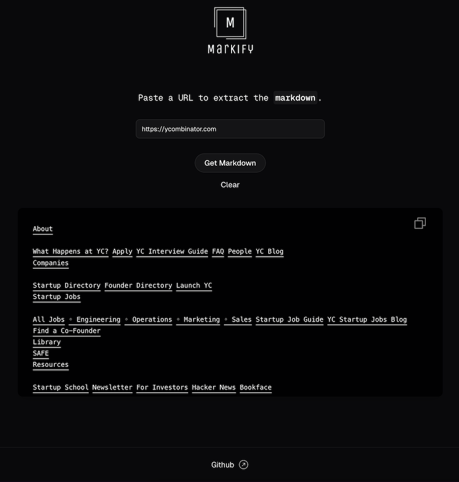

# Markify Web

Web application that extracts clean, structured markdown from any URL. It provides a simple and intuitive interface for
users to convert web content to markdown format.

## Getting Started

1. Install dependencies:
```bash
npm install
```

2. Create a `.env.local` file in the root directory with your Clerk credentials:
```bash
# Clerk Auth Environment Variables
NEXT_PUBLIC_CLERK_PUBLISHABLE_KEY=your_clerk_publishable_key
CLERK_SECRET_KEY=your_clerk_secret_key
```

3. Run the development server:
```bash
npm run dev
```

Open [http://localhost:3000](http://localhost:3000) to see the application.



## Tech Stack

- Next.js 15
- React 19
- TypeScript
- TailwindCSS
- markify-ts
- Clerk (Authentication)

## API

The application exposes a simple API endpoint:

```
GET /api/markify?url=<url>
```

Returns markdown extracted from the provided URL.

## License

MIT